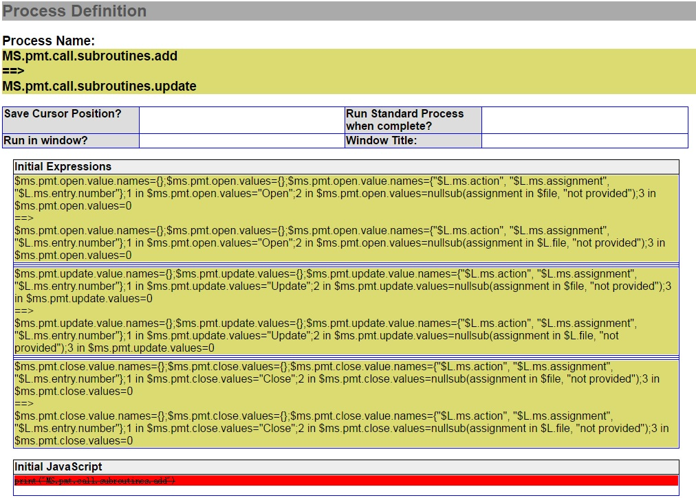

#HP Service Manager Object Diff
---

This project is created aimed to compare Service Manager objects, no matter in the same environment or different environments, and show the compare result in user friendly way. 

Follow below steps to use it:

1. Load the [Diff_WebService.unl](Resources/Diff_WebService.unl "Diff_WebService.unl") file into your Service Manager.
	> In the unload package, there are 5 objects
	> 
	> extaccess: **CompareService**
	> 
	> extactions: **ObjectCompare.Dispatcher**
	> 
	> ScriptLibrary: **MS_ObjectCompare_Handler, MS_SCFileGenerator, MS_JSON_Util**
	> 
	> After loaded, a web service created, you can retrieve object detail and get the data in json format.
	> 
	> This is the sample request  [SampleRequest.xml](Resources/SampleRequest.xml "SampleRequest.xml") to get **probsummary** formatctrl. And expected to get the response like this [SampleResponse.xml](Resources/SampleResponse.xml "SampleResponse.xml") 

2. Refer the code within [ObjectDiffDemo](ObjectDiffDemo/ObjectDiffDemo "ObjectDiffDemo") to compare and show the compare result.

Following is an example to compare 2 process record. The yellow background indicates the data is updated, and red background indicates the data is removed while the green background indicates the data is added.  
[CompareResult.html](Resources/CompareResult.html "CompareResult.html")

